# Analysis Methods

a table showing the preprocessing and analysis pipeline

packages used: cateyes, I2MC, eyekit

## Preprocessing & Quality Control

### Step 00. plot for events

(add plots here)

### Step 01.a. select for valid data

-   some explanation

-   Criteria for cleaning: BPOGV == 0 or BPOGX \> 1 or BPOGY \> 1 (normalized), with the padding of 13 samples around the invalid samples.

-   report for statistics: percentage of invalid data (or show with plots across participants

::: {#fig-comparisons layout-ncol="1"}
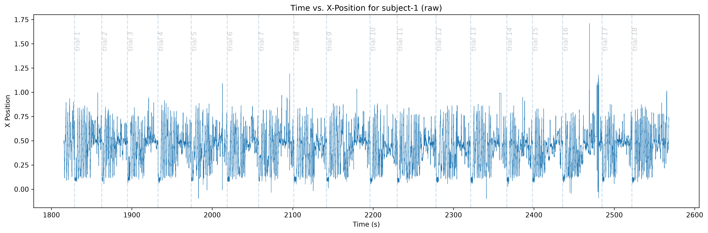{#gaze_x_raw} 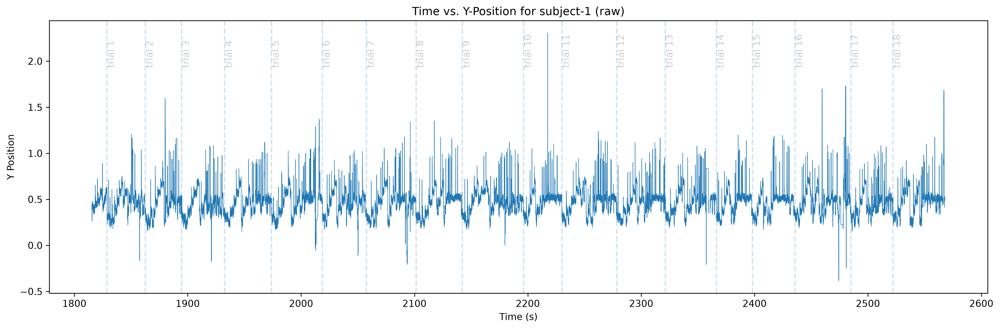{#gaze_y_raw}

Raw Gaze Across Time
:::

::: {layout-ncol="1"}
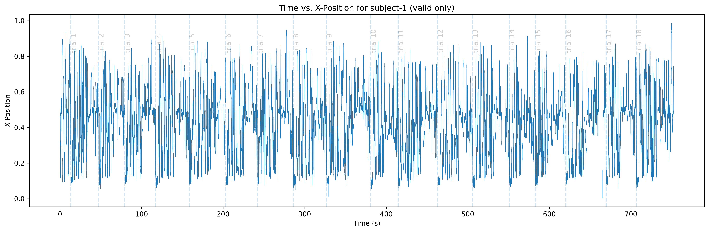 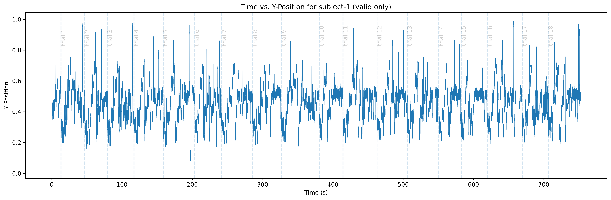

Clean Gaze Across Time (with invalid samples removed)
:::

### Step 01.b. unit conversion

-   better comparison

-   required by some analysis?

-   plot for the accuracy and precision on the fixation cross

### Step 02. fixation classification \[save point: both the preprocessed one and the fixations\]

-   compare between three methods. mention why other methods are not used. reasoning for the choose of I2MC (note: compare with the fixation distribution from the literature)

    -   sanity check: plotting for classification results from all the three methods. also fixation distribution and main sequence

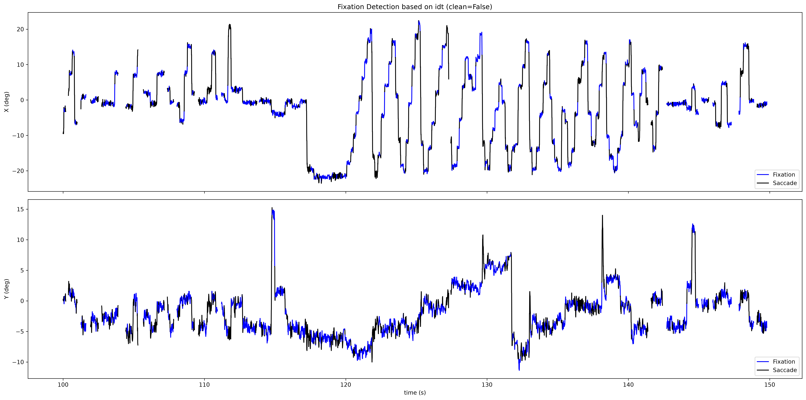 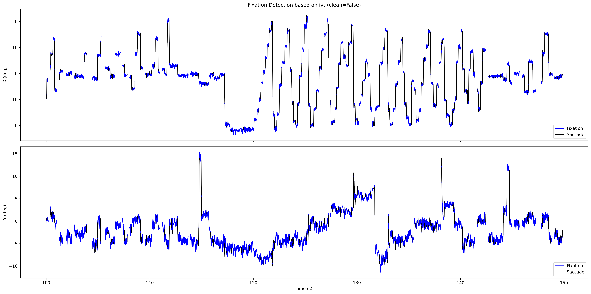 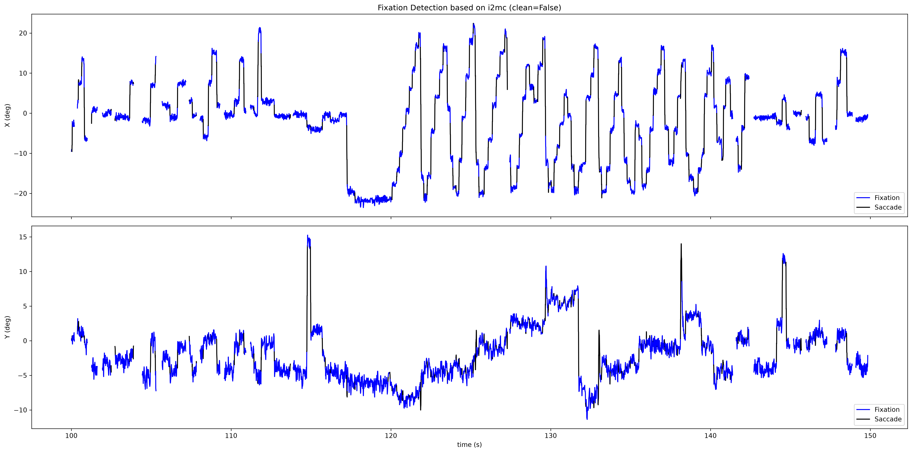

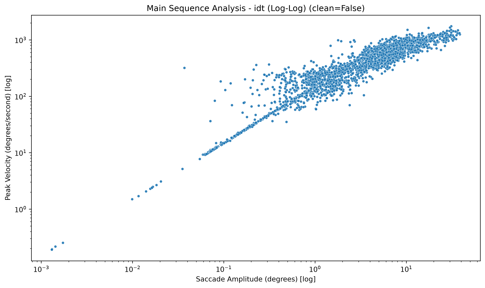 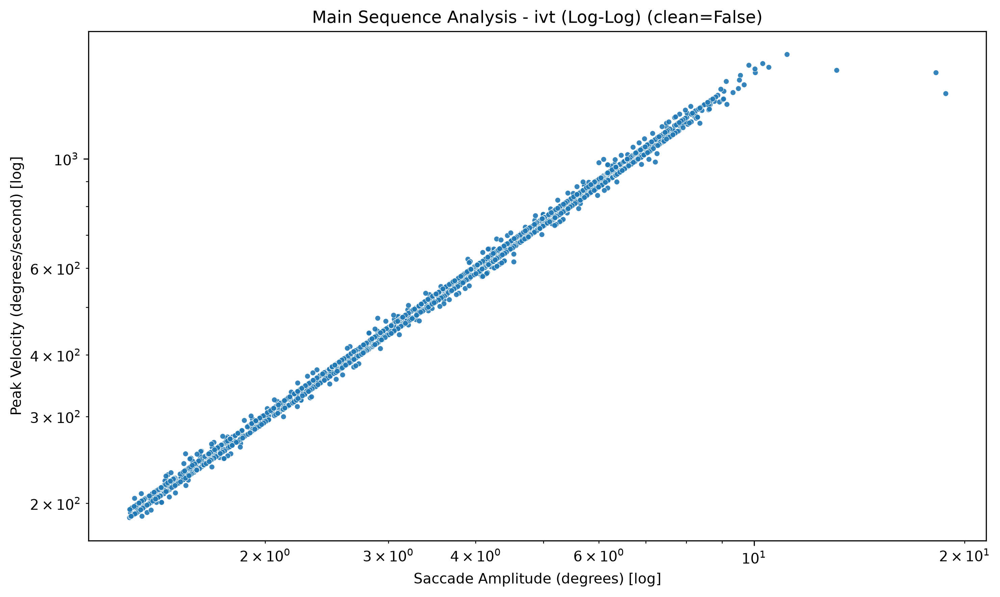 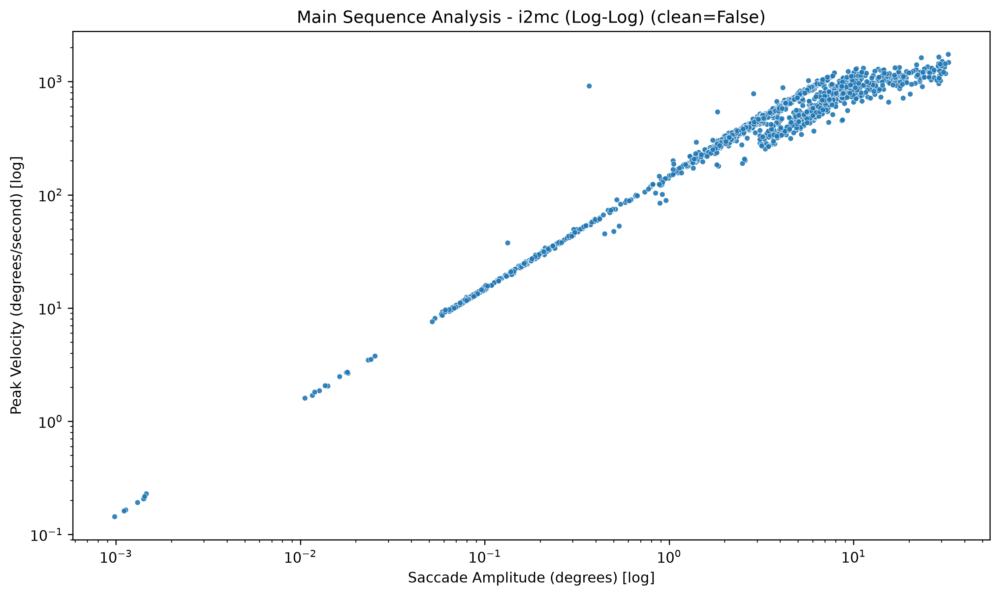

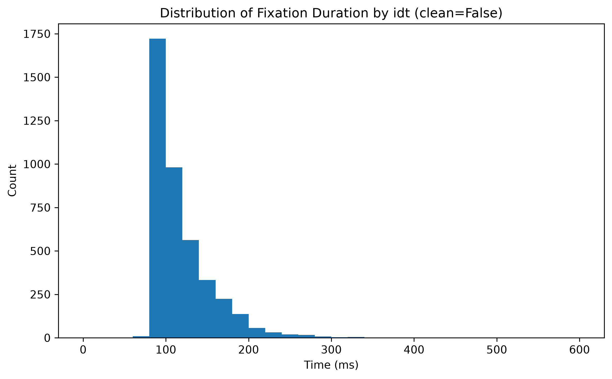 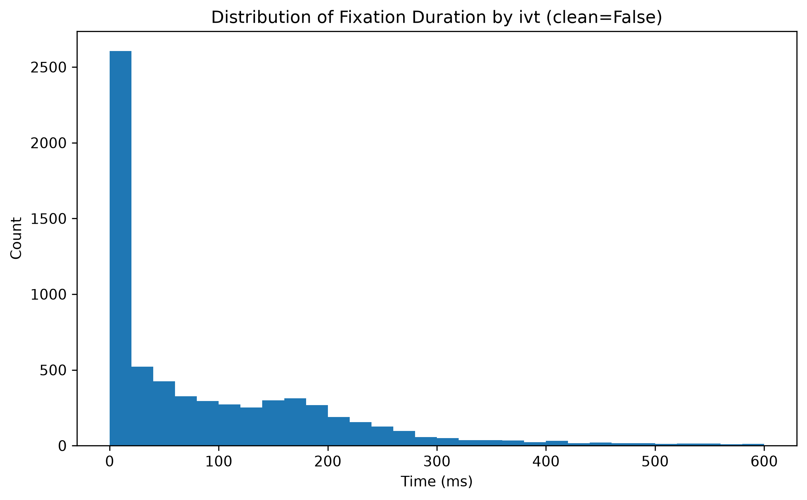 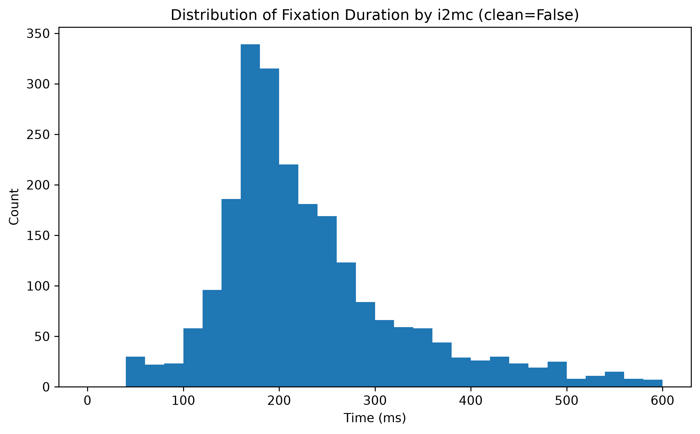

-   merge and clean

    -   exclude the too short and too long fixations

    -   criteria

    -   sanity check: plotting for fixation distribution and main sequence

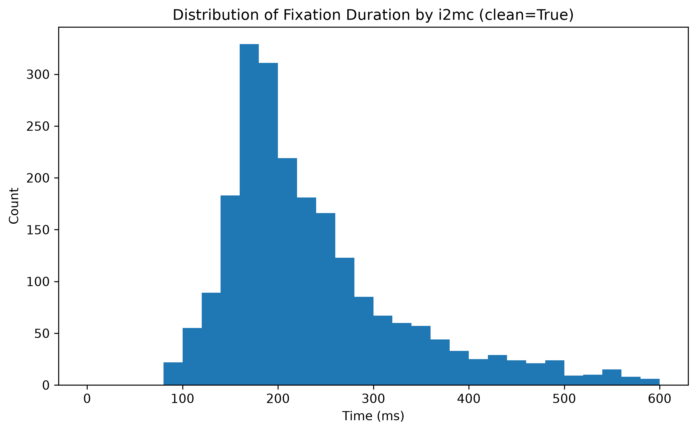

### Step 03. Drift correction \[textblock, seq, and aoi used for eyekit\]

-   sanity check: gaze path (multiple to show the tail, different reading pattern (customized plotting)

-   manual tail truncation: simple principle - back and forth within relatively small radius / horizontally in the center of the screen, random jumping. admit the limitation

    -   sanity check: before and after truncation (customized plotting)

    -   mention the **limitation**: subjective judgement, might be biased, hard to tell the point where the participant stopped reading unless probing into their brain (consequence: early measures might be more reliable than the late ones)

(plots here)

-   introduce eyekit - new gazepath (not sure if mention the misalign)

-   drift correction: compare different methods, mention the regression, select for the best 3 candidates. report for the stats

-   methods used

    -   sanity check: plotting for different gazepath (briefly mention the horizontal misalignment of AOI and text, might be due to the rendering difference. final analysis is based on the coordinates of AOI boxes recorded during the experiment

    -   mention the **limitation** -\> bigger chance of misalignment on the side (AN and spillover might be a more reliable marker than RN)

    -   maybe also try drift correction without tail truncation and compare the stats/results

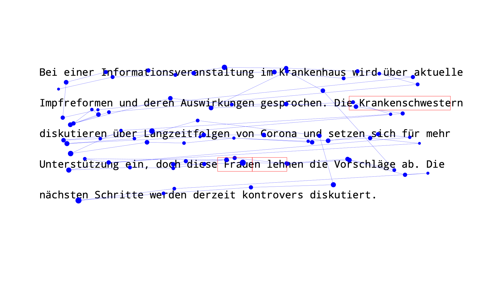 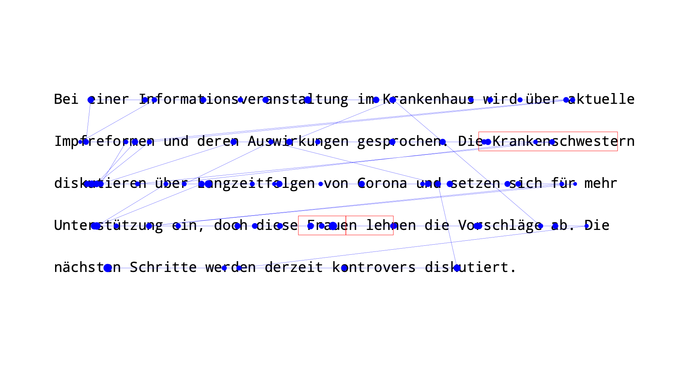

### Step 04. exclude invalid participants and trials (reserved for later steps)

-   also those with too much noise, delta too high, kappa too low (need some manual inspection)

## Analyis pipeline (accompanied with plotting if have time)

1.  Analysis on gaze data: operated on fixations only. why?
    1.  Early measures
        -   reasoning

        -   First pass fixation: explanation

        -   Go past analysis: explanation
    2.  Late measures
        -   reasoning

        -   Total fixation: explanation

        -   Regression in/out: explanation
    3.  Statistical analysis
2.  Analysis on demographic data (NOTE: better turn into excel?)
    1.  Descriptive report
        -   age, political, gender distribution, frequency of use and perception, time when they first learn about gender neutral language
    2.  Inferential statistics
        -   correction between all the gaze measures and their age, frequency of exposure (whats the best way to represent?)

        -   gender comparison